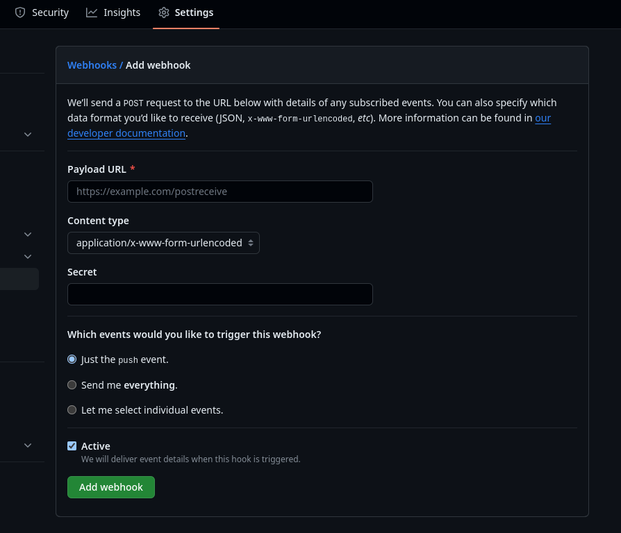

# angular-app

## Inner Loop

- Install Node/NPM latest versions
- Install Angular CLI via `npm install -g @angular/cli`
- Create a workspace via `ng new angular-app` and fill out the form questions
- Run `cd angular-app` to enter the application directory
- Run `ng serve --open` to open the sample application in a browser
- Run Jasmine tests via `ng test`

### Podman

We will be using `podman` instead of `docker` for local container management tooling. The commands are pretty much interchangeable (in case you were to find examples elsewhere on the internet).

### Containerfile

> Note: This section is currently incorrect until we adjust the new-app command to use the Containerfile instead of the Dockerfile.

We will be using `Containerfile` instead of `Dockerfile` for defining our containers. Again, the definitions are virtually the same.

We added a Containerfile to the directory to build the application and be used to serve the content once deployed to the OpenShift cluster.

## Nginx

Added a simple nginx.conf configuration file to tell the NGINX server where the content lives and how to serve it. This file is used inside the container.

### Building Containers Locally

- From the repo's root, go into the Angular directory `cd angular-app`
- Build the container image via `podman build -t angular-app:latest .`
-

> Note: My container DNS settings are currently borked from another effort, so I needed to also add `--dns=8.8.8.8` to my `podman build` command. You will not need to do this.

### Running Containers Locally

- Run the container locally via `podman run --rm -d -p 8080:8080 angular-app:latest` and a container id will be displayed.
- Visit http://127.0.0.1:8080 in your web browser and you should see the application.
- Stop the container via `podman stop {CONTAINER_ID_FROM_EARLIER}`

## Outer Loop - Docker Build Strategy

### OpenShift

We will be using OpenShift to deploy our application to a cluster. We will be using the `oc` command line tool to interact with the cluster.

#### Deploying to OpenShift via the CLI

- Login to the cluster
- Create a new project via `oc new-project mean-stack-app`
- Create a new application via `oc new-app https://github.com/HunterGerlach/mean-stack-app.git --strategy=docker --context-dir=angular-app` where you replace the URL with your own repository URL and the context-dir with the directory containing your application
  - Note: The repository name is used as the deployment name and is also used by the tigger_binding, so if you change the name in one place just make sure they are all consistent.
- Watch the build logs via `oc logs -f bc/mean-stack-app`
- Expose the application via `oc expose svc/mean-stack-app`
- Once the build is complete, you can view the application via `oc get route` and by visiting the URL in your browser

#### Deploying to OpenShift via the Web Console

- Login to the cluster
- Create a new project via the web console
- Create a new application via the web console in the Workloads section
- Select Git as the source type and enter your repository URL
- Update the context directory to the directory containing your application
- Ensure that it automatically selects the Docker strategy
- Click Create
- Watch the build logs via the web console
- Validate the application is running via the web console by visiting the URL

### OpenShift Pipelines (Tekton)

We will be using OpenShift Pipelines to deploy our application to a cluster. We will be adding the `Pipeline` and `PipelineRun` definitions to our repository and then using the `oc` command line tool to interact with the cluster.

Once you have the application deployed to the cluster, you can add the pipeline and pipeline run definitions to your repository and then run the following commands to deploy the pipeline and run it.

- Login to the cluster
- Create a new project, for example `oc new-project mean-stack-app-pipeline`
- Change into the directory containing the pipeline and pipeline run definitions (e.g. `cd angular-app/cicd`)
- Assuming you wish to use webhooks, apply manifests 01-04 which include the EventListener and TriggerTemplate definitions:

```bash
oc apply -f 01-event_listener.yaml
oc apply -f 02-event_listener_route.yaml
oc apply -f 03-trigger_binding.yaml
oc apply -f 04-trigger_template.yaml
```

- Next, apply the pipeline tasks and pipeline definition:

```bash
oc apply -f 05-git-clone_task.yaml
oc apply -f 06-build_task.yaml
oc apply -f 07-openshift-deploy_task.yaml
oc apply -f 08-pipeline.yaml
```

- Now you need to obtain the URL of the event listener route via `oc get route build-and-deploy-pipeline-event-listener-route -o jsonpath='{.spec.host}'`

- Configure the GitHub webhook by visiting the GitHub project -> Settings -> Webhooks -> Add webhook



- Add the previously copied URL of event listener (don't forget to add `http://` to the beginning of the URL)
- Change content type to application/json
- Leave the rest of the settings as default
- Click Add webhook
- Now, when you push a change to your repository, the pipeline will be triggered and you can view the logs via `oc logs -f pipelinerun/build-and-deploy-pipeline-run`
